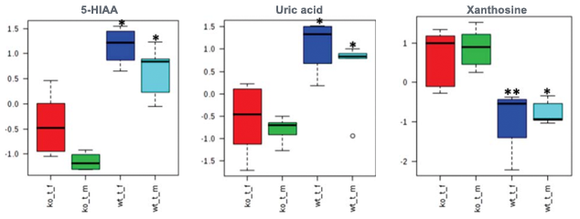
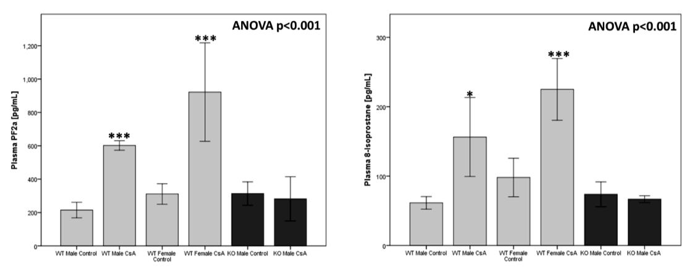
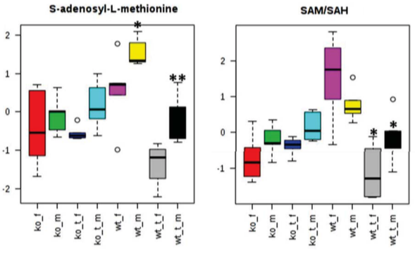
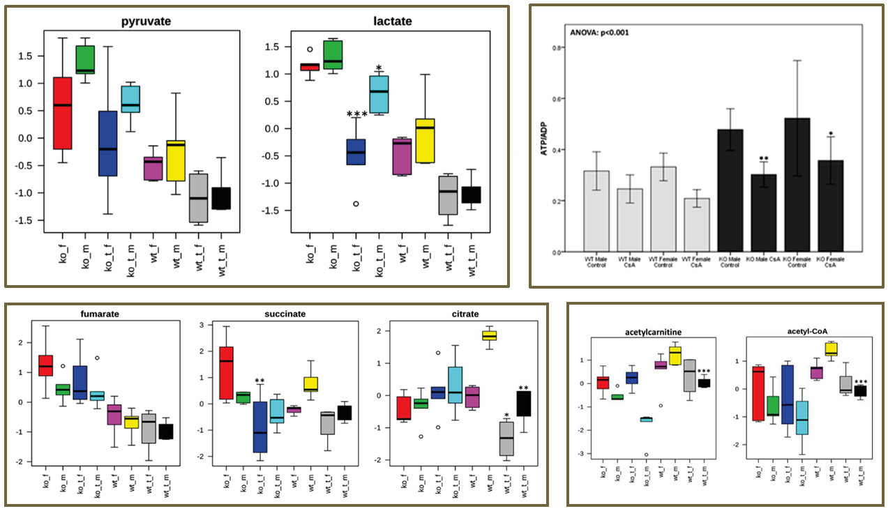
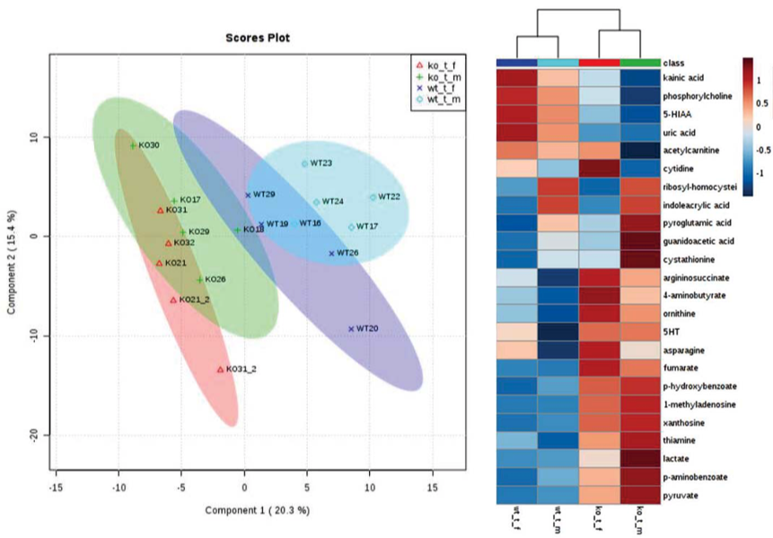
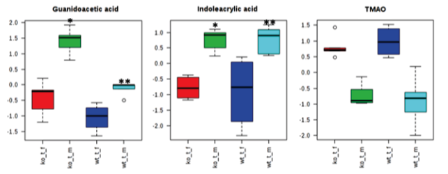

```{r setup, include=FALSE}
knitr::opts_chunk$set(echo = FALSE)  # Hide code by default. Can override chunk-by-chunk
```


# {.col-2 style="grid-row: span 4;"}
<!-- Span the first column for four rows, that way we can capture the usage block, two rows of template examples, and refs/footer information -->

## Abstract 

We treated wild-type and mice lacking cyclophilin (CypD; _Ppif_ -/-) with cyclosporin A (CsA) to test the role and contribution of CypD to widely described CsA-induced renal toxicity and oxidative stress. Our results showed an increase in several known uremic toxins as well as oxidative stress markers prostaglandin F2&alpha; and 8-isoprostane in CsA-treated WT, but not in _Ppif_ -/- animals. Similarly, a decline in S-adenosylmethionine (SAM) and the resulting methylation potential indicative of DNA hypomethylation was observed only in CsA-treated WT mice. This confirms previous reports of protective effects of CypD deletion on the mouse kidney mediated through a stronger resistance of these animals to oxidative stress and DNA methylation damage. However, negative effects of CsA on the glycolysis and overall energy metabolism in _Ppif_ -/- mice also indicated that additional, CypD-independent pathways are involved in the toxic effects of CsA on the kidney. 


## Background

<div class="fullwidth"> Mitochondrial dysfunction and oxidative stress have been implicated in CsA-induced nephrotoxicity. Controversial reports have suggested that CypD deletion may or may not be protective in the protection of cells against oxidative stress-induced cell death. </div>

### Cyclophilin D
CypD (encoded by the _Ppif_ gene) is an essential structural component of the mitochondrial permeability transition pore (MPTP) and is involved in MPTP opening and subsequent regulation of cell death.[@ref1;@ref2] Despite years of research, the mechanism of CsA nephrotoxicity remains poorly understood, with several potential mechanisms identified: oxidative stress,[@ref3;@ref4] apoptosis,[@ref5] metabolic changes [@ref6;@ref7;@ref8;@ref9] and an increase of vascular resistance resulting in decreased renal blood flow.[@ref10;@ref11]

### Cyclosporine
CSA blocks the phosphatase activity of calcineurin after binding to its cellular co-effectors, the cyclophilins. [@ref12;@ref13] CsA is responsible for a significant improvement of short-term survival of transplant organs. [@ref14] However, long-term graft survival in renal transplant recipients has only seen a marginal improvement. [@ref15;@ref16] As of today, approximately 50% of renal allograft transplant patients still lose their transplant after 12 years, often due to immunosuppressant-induced nephrotoxicity. 

### 
<div class="fullwidth">CsA has been shown to protect against ischemia/reperfusion (I/R) organ injury, [@ref17;@ref18;@ref19;@ref20;@ref21] an observation that most likely arises from CsA’s ability to inhibit CypD. Mice that lack CypD have enhanced capacity to retain mitochondrial calcium, show delayed opening of the MPTP when calcium overload is present, and have smaller infarctions and less damage after prolonged I/R.[@ref22;@ref23;@ref24;@ref1;@ref25] However, _Ppif_ -/- mice are more susceptible to heart failure initiated by different stimuli, such as exercise-induced hypertrophy. [@ref26;@ref27] Mechanistically, CypD ablation is associated with elevated levels of mitochondrial matrix Ca<sup>2+</sup> that in turn leads to increased glucose oxidation relative to fatty acids. This metabolic switch limits the ability of organs, including kidney, to adapt during stress,[@ref26;@ref27;@ref28] and is similar to the effects we have observed after CsA treatment.[@ref6;@ref8;@ref9]</div>

## Hypothesis 

<div class="fullwidth">As one of the major potential molecular targets of CsA nephrotoxicity is missing, we hypothesized that mice with CypD deficiency will show a better outcome following CsA treatment with regard to changes in inflammatory response, less generation of oxidative stress, and a higher renal energy capacity as compared to normal mice treated with CsA.</div>

## Methods

#### Mouse experiments

Eight-week old male and female mice (WT B6.129SF2 and _Ppif_ -/-) were given either skim milk or treated by oral gavage with CsA at (a) 25 mg/kg/day and (b) 50 mg/kg/day for 28 days. Animals were weighed weekly and blood glucose was monitored at the same time via tail vein prick blood collection. Urine and plasma collections occurred biweekly. At the end of treatment, the mice were sacrificed and blood, urine, and tissues were collected.

#### Kidney histology

Kidney tissue samples were fixed and embedded before staining in eosin solution. Stain intensity was optimized in ammonia water and sections were dehydrated in xylene. Images of the kidney sections were captured and 25 high-powered fields were examined in the tubulo-interstitium of the cortex and outer medulla of each section. The kidneys were examined for inflammation, epithelial necrosis, loss of brush border, and tubular dilatation.

#### Analyte quantification

Oxidative stress markers, creatinine, CsA, and high-energy phosphate metabolite concentrations were determined in extracted blood, plasma, urine, and snap-frozen tissue samples with LC-MS/MS. Corresponding deuterated internal standards were used for quantification.


#### Metabolomic analysis

Tissue samples were homogenized and subjected to a modified semi-quantitative targeted metabolomics. Positive identification of the metabolites of interest was performed through injection of pure compound standards. Some proteins were further analyzed by Western blot.


# {.col-2}

## Physiological and Histological Changes
 
Neither phenotype nor treatment with CsA impacted animal weight gain or blood glucose levels. Inflammation was not observed in the glomerular or tubulointerstitial compartments of either strain of mice. Vascular congestion was seen in the glomeruli of _Ppif_ -/- mice. 

#{.col-4}

## Creatinine & CsA

No changes in CsA blood concentration were observed between the mice  and plasma creatinine levels increased in all CsA-treated animals, but reached significance only in WT animals treated with 50 mg/kg/day CsA.


## Uremic Toxins

<div class="fullwidth">{style="width:100%;"}
Hyperuricemia increases risk of hypertension, diabetes, and metabolic syndrome in renal transplant patients. High uric acid concentrations and low xanthine levels suggest increased conversion of xanthine to uric acid. 5-HIAA accumulates in uremic patients and induces endothelial inflammation and oxidative stress leading to increased cardiovascular risk in kidney disease.
</div>


#{.col-4}


## Oxidative Stress 

<div class="fullwidth"> {style="width:100%;"}

Plasma levels of oxidative stress markers PF2&alpha; and 8-isoprostane increased in WT male and female mice, but not in _Ppif_ -/- male mice.</div>


## DNA Methylation

<div class="fullwidth"> {style="width:100%;"}

Reduced SAM leads to reduced cellular methylation capacity and DNA hypomethylation in _Ppif_ -/- animals.</div>


#{.col-2}

## Energy Metabolism
{style="width:100%;"}
Following CsA treatment, _Ppif_ -/- animals showed significantly lower kidney lactate concentrations, unchanged Krebs cycle activity, and significant decreases in energy production following CsA treatment. _Ppif_ -/- animals shift from &beta;-fatty acid oxidation towards glucose metabolism, which is exhibited by lower concentrations of acetyl-CoA and acetyl-CoA-transporting acetylcarnitine as compared to their WT counterparts.


#{.col-4}

## Metabolomics

<div class="fullwidth"> {style="width:100%;"}

PLSDA revealed separation of the CsA-treated males and females. Metabolites that were significantly different across CsA-treated animals were projected and used for sample clustering. </div>


#{.col-4}

## Gender Differences

<div class="fullwidth"> {style="width:100%;"}
Several metabolites varied in CsA-treated females as compared to males (independent of the mouse strain). Our results suggest that female mice are more sensitive to nephrotoxic effects of CsA when compared to their respective male counterparts, despite their estrogen-mediated protected status when untreated.
</div>

# {.col-1 .theme-minimalist} 

## References {style="--header-color:Black; --other-color-for-h2-gradient:Gray;"}
<div id="refs" class="references"></div>
