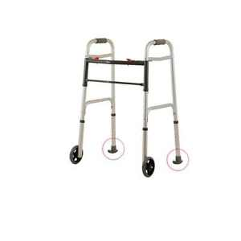
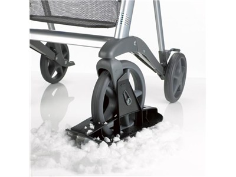

# Multi-Surface Walker {-#walker}

*A walking mobility device designed for the active elderly in multi-surface applications including indoor, outdoor, and icy surfaces.*

## General Comments {-#generalwalker}

There are some cool ideas out there related to improving walker/rollator technology. One example is these easily attachable walker "skis:"

```{r, echo=FALSE,out.width="40%",fig.align='center'}

```

A similar technology exists for rollators:

```{r, echo=FALSE,out.width="40%",fig.align='center'}

```

You guys might also check out these webpages: [luxury rollators and walkers](https://www.elderluxe.com/mobility/walkers-and-rollators/) and [an advanced walker safety system](https://techcrunch.com/2014/01/07/sentry-scientific-wants-to-remake-walker-tech-to-keep-seniors-safe-and-on-the-go/?source=gravity), as well as [the brochure for an "active rollator."](https://drive.google.com/file/d/1VOEt8hXgqrycTXxwV3bqeLXFfIrpnoc_/view?usp=sharing)

## Mobility and Quality of Life (2011) {-#mobilityqol}

This paper shows that mobility is highly correlated with quality of life and feelings of autonomy, which is great foundational evidence that an improved walker design could benefit elderly patients both physically and psychiatrically.

**"Mobility and quality of life in elderly and geriatric patients." Hudakova *et al.* *International Journal of Nursing and Midwifery.* 2011.** [[.pdf]](https://drive.google.com/file/d/10ttgaJteWNEqiZ98xzR5MTG904RExFQC/view?usp=sharing)


```{r, echo=FALSE,out.width="100%",fig.align='center'}
myimages<-list.files("images/22/", pattern = ".png", full.names = TRUE)
knitr::include_graphics(myimages)
```

***Big Idea:*** There's an enormous (and growing) aging and elderly population. Since evidence supports that mobility is important for quality of life, we need to enable seniors to live well by providing the best possible supportive technology.


## Enhancing Independence (2013) {-#enind}

This is a high-effort thesis with lots of thought put towards design. You should glance through it for inspiration, since it's working towards the same concept as your project.


**"Enhancing the Independence and Mobility for the Elderly and Disabled: A New Approach for Older Users." Henriksen. *Massey University.* 2013.** [[.pdf]](https://drive.google.com/file/d/183FypA8c0j51KkuCh2qViU8jLOfhQtbU/view?usp=sharing)


```{r, echo=FALSE,out.width="80%",fig.align='center'}
myimages<-list.files("images/23/", pattern = ".png", full.names = TRUE)
knitr::include_graphics(myimages)
```

***Big Idea:*** You might consider a walk/ride (or at least walk/sit) capability for your walker. Old people get tired quickly, especially when they're engaging in physical activity!


## Walking Aids and Falls (2015) {-#falls}

This study looks at whether using a walking aid predicts for future falls. Turns out, using aids (walkers, rollators, wheelchairs) is a risk factor for falling in the future!

**"Understanding the Relationship Between Walking Aids and Falls in Older Adults: A Prospective Cohort Study." de Mettelinge *et al.* *Journal of Geriatric Physical Therapy.* 2015.** [[.pdf]](https://drive.google.com/file/d/1jGY6zmxQik-o4YGRsad9jCM9q-_X7JbA/view?usp=sharing)


```{r, echo=FALSE,out.width="80%",fig.align='center'}
myimages<-list.files("images/24/", pattern = ".png", full.names = TRUE)
knitr::include_graphics(myimages)
```

***Big Idea:*** If using a walking aid is a positive predictor for future falls, you'd want the safest possible walking aid to prevent such an occurence, right? Keep this in mind with your design!

## Walking in Relation to Mortality (2018) {-#walkingmortality}

Does walking (or engaging in some amount of physical activity) as an older person actually improve your chance for survival? This study shows, pretty convincingly, that it does.

**"Walking in Relation to Mortality in a Large Prospective Cohort of Older U.S. Adults." Patel *et al.* *American Journal of Preventive Medicine.* 2018.** [[.pdf]](https://drive.google.com/file/d/1GrEBME9hAZcGPHuo0gO3t9rCLpynxmii/view?usp=sharing)

```{r, echo=FALSE,out.width="100%",fig.align='center'}
myimages<-list.files("images/25/", pattern = ".png", full.names = TRUE)
knitr::include_graphics(myimages)
```

***Big Idea:*** Scooters might be safer than walkers, but being sedentary (not getting any physical activity) increases your likelihood of dying sooner as an elderly person.


## Summary Recommendations {-#summarywalker}

Check out the examples I linked of existing high-quality multi-surface walkers and rollators. You might find some good ideas to include in your project! Big takeaways from the research are: Older people are happier and live longer when they're active and more independent (both of which might be enabled with a walker or similar walking aid). At the same time, using a walking aid positively predicts for future falls, so you need to be careful in your design to maximize safety for the user.


